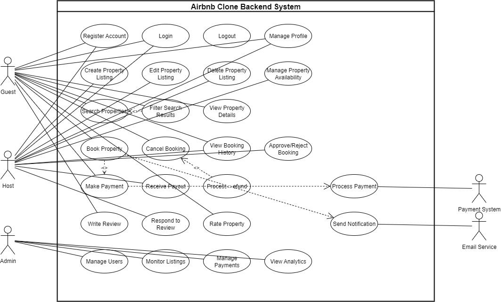

# Airbnb Clone Backend - Use Case Diagram

## What is a Use Case Diagram?
A Use Case Diagram is a visual representation that shows:

1. **Actors** - External entities (users, systems) that interact with the system
2. **Use Cases** - Specific functionalities or services the system provides
3. **Relationships** - How actors interact with use cases and how use cases relate to each other

### Key Components a Use Case Diagram:

- **Actors (stick figures)** - Guest, Host, Admin, Payment System, Email Service
- **Use Cases (ovals)** - Register Account, Book Property, Make Payment, etc.
- **System Boundary (rectangle)** - Defines what's inside vs outside the system
- **Relationships (lines)** - Shows which actors can perform which use cases
- **Include/Extend** - Shows dependencies between use cases

**Purpose:** Helps developers understand system requirements from a user's perspective and ensures all user interactions are captured.

### Key Actors:

1. Guest - Users who search and book properties
2. Host - Property owners who list and manage rentals
3. Admin - System administrators
4. Payment System - External payment processor
5. Email Service - External notification service

### Core Use Cases Covered:
User Registration & Authentication:

- Register Account
- Login
- Logout
- Manage Profile

### Property Management:

- Create Property Listing
- Edit Property Listing
- Delete Property Listing
- Manage Property Availability

### Search & Discovery:

- Search Properties
- Filter Search Results
- View Property Details

### Booking System:

- Book Property
- Cancel Booking
- View Booking History
- Approve/Reject Booking

### Payment Processing:

- Make Payment
- Process Payment
- Receive Payout
- Process Refund

### Reviews & Ratings:

- Write Review
- Respond to Review
- Rate Property

### Admin Functions:

- Manage Users
- Monitor Listings
- Manage Payments
- View Analytics

### Notifications:

- Send Notification

### Relationships:

- **Associations (solid lines)** - Connect actors to use cases they can perform
- `<<include>>` (dashed arrows) - Mandatory dependencies (e.g., booking requires payment)
- `<<extend>>` (dashed arrows) - Optional extensions (e.g., filtering extends search)

### Screenshot of the Use Case Diagram

